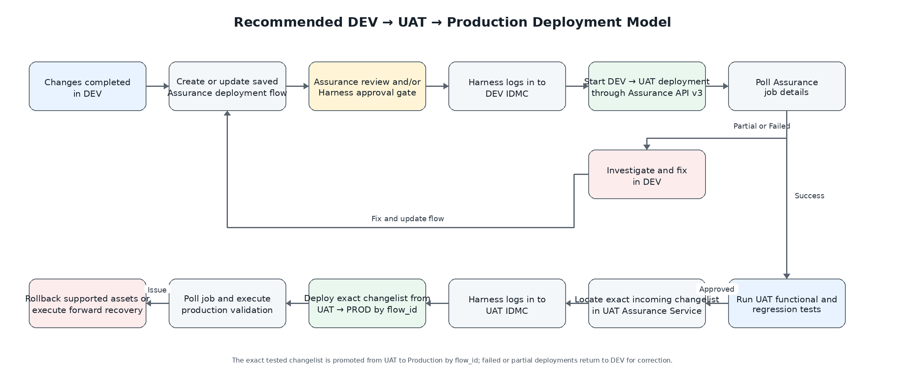

# IDMC Assurance Service Deployment Design

## DEV → UAT → PRODUCTION for B360/MDM and Cloud Data Integration Assets

**Document status:** Draft for implementation proof of concept and Informatica expert review  
**Prepared:** 2026-07-28  
**Primary sources:**

- *IDMC Assurance Service – Data Integration User Guide*, June 2026 (the “DI Guide”)
- *IDMC Assurance Service – Master Data Management User Guide*, May 2026 (the “MDM Guide”)
- Informatica official REST API documentation on login, session IDs, and API authentication

---

## 1. Purpose

This document defines an implementable approach for deploying Informatica IDMC assets through **Assurance Service** from **DEV to UAT and then from UAT to PRODUCTION**.

The requested scope includes:

- **B360 / MDM SaaS**
  - Business Entity
  - Hierarchy
  - Relationship
  - Reference Data / Reference Dataset
  - Job Definitions: Ingress, Egress, and Match and Merge
- **Cloud Data Integration (CDI)**
  - Mapping
  - Task, especially Mapping Task
  - Taskflow

The design covers:

1. Prerequisites and access control.
2. Supported deployment asset types.
3. Target organization setup.
4. Deployment flow creation and review.
5. API execution from a Harness pipeline.
6. DEV-to-UAT and UAT-to-PRODUCTION promotion using deployment changelists.
7. Rollback and recovery.
8. Source control usage.
9. Advantages, limitations, open questions, and team responsibilities.

This is intentionally a practical deployment design rather than a broad IDMC platform redesign.

---

## 2. Recommended Deployment Model

The recommended model is shown below. A PNG image is used instead of a Mermaid code block so that the diagram renders in Markdown viewers that do not support Mermaid.



### 2.1 Key design decisions

1. **DEV is the authoring environment.** Defects found in UAT are corrected in DEV and redeployed. Changes should not be repaired directly in UAT except for emergency diagnosis.
2. **Use a saved deployment flow as a reusable template for DEV → UAT.** The flow contains selected assets and environment mappings.
3. **Use an exact deployment changelist for UAT → PRODUCTION.** A changelist represents the assets actually deployed into UAT and is designed for promoting the tested set to the next SDLC environment. The DI Guide explicitly describes this DEV/QA-to-PROD usage. [DI Guide, pp. 125–126]
4. **Use `flow_id`, not only a deployment name, for automated promotion.** If multiple changelists share a name, the API can select the latest one. An exact ID prevents an untested revision from being promoted. [DI Guide, pp. 407–410]
5. **Use dedicated native IDMC service accounts for unattended API execution, subject to IAM approval.** Personal SSO identities require interactive approval in the Assurance UI and are not a dependable CI/CD identity model.
6. **Treat the Assurance review and the Harness pipeline approval as two separate controls until a POC confirms how API execution is tied to an approved Assurance review.** The public Start Deployment API accepts a saved flow or changelist, not a review ID.
7. **Choose either deployment backup or post-deployment source-control check-in for a given deployment.** Assurance does not allow both options in the same run. [DI Guide, pp. 92–99]

---

## 3. Prerequisites Checklist

## 3.1 Licensing and environment prerequisites

| Item | Requirement | Owner | Verification |
|---|---|---|---|
| Assurance Service | IDMC Assurance edition must be enabled. | Informatica Platform Team | Assurance Service appears in IDMC My Services. |
| Deployment license | The **Deployment** license must be enabled in the **source organization** used to create and run the deployment. | Informatica Platform Team | Check organization licenses/editions. |
| Product licenses | Target must have the required B360/MDM and CDI licenses and compatible permissions. | Informatica Platform Team | Compare source and target licenses before POC. |
| Target registration | UAT must be added as a target in DEV; PROD must be added as a target in UAT. | Platform Team | Assurance **Settings → Organization**. |
| Pod compatibility | Source and target must be supported within the same global pod relationship defined by Assurance Service. | Platform Team | Compare organization pod URLs. |
| Target readiness | Connections, runtime environments, projects/folders, schedules, application setup, and other environmental dependencies must exist or be mapped/created. | Platform and Application Teams | Pre-deployment readiness checklist. |
| MDM application compatibility | For MDM deployment, source and target application versions must match and target application setup must be complete. A failed application-level validation blocks deployment. | B360 Platform Team | MDM pre-deployment validation. |
| Harness connectivity | Harness delegates/runners must reach the IDMC login endpoint, the Assurance host, and the applicable target base API URL over TLS. | DevOps / Network Team | Network connectivity test. |

The source and target organizations should be set up as a stable SDLC chain:

- DEV Assurance target: UAT
- UAT Assurance target: PRODUCTION

A direct DEV → PRODUCTION target may be configured for emergency use, but it should not be used by the standard release pipeline.

## 3.2 Assurance Service roles and privileges

The guides list **Admin**, **Deployer**, and **Operator** as roles capable of deployment-related actions. A least-privilege custom role is preferable to assigning Admin to pipeline identities.

### 3.2.1 UI deployment-flow designer

The person creating or modifying a deployment flow needs, at minimum:

- View Assets
- Asset Actions
- View Deployment Flow
- Create Deployment Flow
- Organization Settings, when the person is responsible for adding target organizations
- Run Deployment Flow only when the same person will test or execute the flow
- Source organization **Asset – export** privilege

### 3.2.2 API/pipeline runner in the source organization

The dedicated pipeline account in DEV or UAT should have:

- View Assets
- View Deployment Flow
- Run Deployment Flow
- Asset Actions when required by the selected deployment behavior
- Source organization **Asset – export** privilege
- Access to Assurance Service and the Deployment license
- Permission to read the specific saved flow/changelist and job history

A simple implementation may initially use the built-in **Deployer** role for the POC, then replace it with a least-privilege role after the API calls and object access are confirmed.

### 3.2.3 Target organization service account

The target account, whether native or SSO, requires:

- Target organization **Asset – import** privilege
- Access to the product services and asset types being imported
- Sufficient privileges to create or update the mapped assets, dependencies, connections, projects/folders, and runtime configuration where the deployment requires those actions

The source documents explicitly state export privilege for the source user and import privilege for the target user. [DI Guide, pp. 22, 78–79, 393–395; MDM Guide, pp. 42–45, 140–142]

### 3.2.4 Additional platform privileges

The Assurance guides also identify these platform privileges where applicable:

- Read User
- Read Role
- Read Group
- Read Privilege
- Asset – export
- Asset – import
- Asset – pull version, when version/source control is used
- View Application Integration Designer, for CAI assets

## 3.3 Dedicated service-account requirements

For an unattended Harness pipeline, use non-personal accounts such as:

- `svc_idmc_assurance_dev`
- `svc_idmc_assurance_uat`
- `svc_idmc_assurance_prod_import`

Recommended controls:

1. Native IDMC identity dedicated only to deployment automation.
2. No interactive user email, personal ownership, or dependence on an employee lifecycle.
3. Password stored only in Harness Secrets Manager or the approved enterprise vault.
4. Password rotation and account-expiry monitoring owned by IAM/Platform Operations.
5. No credentials printed in Harness execution logs.
6. Separate source runner and target importer identities where segregation of duties is required.
7. Reauthenticate at the beginning of each pipeline stage instead of reusing an old session.

### Why native service accounts are recommended

The Assurance target-organization setup supports SSO through an approval-based mechanism. A user must request access and another browser session must approve the request. That is appropriate for interactive use but creates a dependency on a person for pipeline execution. [DI Guide, pp. 393–394]

Informatica also documents that SAML API login requires an identity-provider token, and a SAML token already used for SSO cannot be reused for API login. This makes SSO automation possible only with an explicitly designed identity-provider integration, not by reusing an interactive approval session.

**Important:** The Assurance API v3 sample requires the source Assurance `icSessionId` and target organization ID/base URL, but it does not show target username/password or a target session ID. The POC must confirm how unattended target authentication is resolved and whether the target organization registration retains a usable authorization relationship. This is a high-priority Informatica expert question.

## 3.4 Release naming and traceability

Use a unique release identifier in every saved flow and deployment/changelist name. Example:

```text
B360_CDI_R2026.07.28_01_DEV_UAT
B360_CDI_R2026.07.28_02_DEV_UAT
```

Record the following in Harness execution outputs and the release ticket:

- Release ID
- Saved flow name and `flow_id`
- DEV → UAT `job_id`
- UAT changelist `flow_id`
- UAT test evidence and approval
- UAT → PROD `job_id`
- Backup enabled/disabled
- Source-control check-in enabled/disabled
- Final job status and failed asset details

Do not reuse the same name for materially different UAT test cycles. If a name must be reused, promotion must still use the exact `flow_id`.

---

## 4. Supported Deployment Asset Types

The following table consolidates the asset types explicitly listed by the two attached Assurance Service guides.

| Product category | Supported deployment asset types | Important notes |
|---|---|---|
| **Cloud Data Integration** | Tasks: DRS, DSS, MT/Mapping Task, Masking Task; Taskflow; Project; Folder; Advanced Mapping; Mapping; Mapplet; Business Service Definition; Hierarchical Schema; Fixed-width File Format; Intelligent Structure Model; Hierarchical Mapper | Task is a category. Confirm the exact task subtype before adding it to the release. [DI Guide, pp. 69–70] |
| **Cloud Application Integration** | Process; Guide; AI Connection; Service Connector; Process Object | Process and Guide can be published after deployment. Service Connectors do not support post-deployment connection tests. [DI Guide, pp. 70, 89–90] |
| **Administrator** | Schedule; User; User Role; User Group | Scheduled Jobs are not the same as Schedule assets. After schedules and tasks are migrated, scheduled jobs may need to be created/configured separately. User/group deployment has uniqueness and conflict limitations. [DI Guide, pp. 71–72] |
| **Cloud Data Ingestion & Replication** | Application Ingestion and Replication Task; Database Ingestion and Replication Task; File Ingestion and Replication Task; Streaming Ingestion and Replication Task; File Listener | Validate dependent connections and runtime environments. [DI Guide, p. 72] |
| **MDM SaaS / B360** | Business Entity; Hierarchy; Job Definition; Relationship; Business Event | MDM has an additional Pre Deployment Validation stage. The Configuration stage appears when Job Definition is selected. [MDM Guide, pp. 42–54] |

## 4.1 Requested asset support assessment

| Requested object | Assurance deployment support | Design decision / qualification |
|---|---:|---|
| B360 Business Entity | **Yes** | Explicit MDM deployment type. Entity-level validations can produce warnings or failures. |
| B360 Hierarchy | **Yes** | Explicit MDM deployment type. Include dependencies. |
| B360 Relationship | **Yes** | Explicit MDM deployment type. Include referenced entities and dependencies. |
| B360 Reference Data / Reference Dataset | **No direct support documented** | Reference Datasets are visible in MDM Explore summary, but they are not listed among the supported MDM deployment types. Treat as an unsupported deployment object until Informatica confirms otherwise. |
| B360 Ingress Job | **Yes, as Job Definition** | POC the exact subtype and all CDI dependencies. |
| B360 Egress Job | **Yes, as Job Definition** | POC the exact subtype and all CDI dependencies. |
| B360 Match and Merge Job | **Yes, as Job Definition** | POC the exact subtype and all CDI dependencies. |
| CDI Mapping | **Yes** | Explicit Data Integration deployment type. |
| CDI Mapping Task | **Yes** | Supported under Tasks as MT/Mapping Task. |
| CDI generic “Task” | **Conditional** | Supported only when its task subtype is in the documented supported task list. |
| CDI Taskflow | **Yes** | Explicit deployment type. Configure publication and schedule behavior. |

### 4.2 Scope conclusion

Assurance Service can cover most of the requested B360 and CDI assets, but the current documented gap is **Reference Data / Reference Dataset**. The release procedure therefore requires a small companion deployment step for unsupported assets unless Informatica confirms that Reference Data is included as an automatic dependency or has become directly deployable in the customer tenant.

---

## 5. One-Time Environment Setup

## 5.1 Add the target organization

Perform this once for each source-to-target link.

### DEV Assurance Service: add UAT

1. Log in to the DEV organization.
2. Open **Assurance Service**.
3. Select **Settings** in the upper-right corner.
4. Open **Organization**.
5. Click **Add Organization**.
6. Enter the target UAT username and password.
7. Leave **Request Login** disabled for the dedicated native deployment identity.
8. Select **Pre-Release Environment** only when the target is an Informatica pre-release organization; normal UAT should not be marked pre-release unless it is actually provisioned as such.
9. Click **OK**.
10. Verify that the organization is listed with the expected:
    - Name
    - Organization pod URL
    - Organization type
    - Pre-release flag
    - SSO-enabled flag
11. Verify that the source user has Asset Export and the target user has Asset Import.
12. Execute a small cross-organization comparison or test deployment in the POC to verify access.

### UAT Assurance Service: add PRODUCTION

Repeat the same procedure while logged in to UAT, using the dedicated PRODUCTION importer identity.

### Configuration notes

- Assurance only exposes organizations added under **Settings → Organization** for deployment and cross-organization operations.
- The guides state that target organizations must be within the supported same-global-pod relationship.
- SSO approval requires a user to approve the request from the target organization, often in another browser/incognito session.
- The UI target login session is described as lasting until source logout or 30 minutes of inactivity. Do not assume this browser session is the authorization mechanism used by the API pipeline.

## 5.2 Prepare target environmental dependencies

Before the first deployment, document the environment-specific mapping table:

| Dependency type | DEV value | UAT value | PROD value | Deployment behavior |
|---|---|---|---|---|
| Connection | `<DEV connection>` | `<UAT connection>` | `<PROD connection>` | Reuse mapped target connection; do not deploy secrets from DEV. |
| Runtime environment | `<DEV runtime>` | `<UAT runtime>` | `<PROD runtime>` | Reuse mapped target runtime. |
| Project / folder | `<DEV path>` | `<UAT path>` | `<PROD path>` | Preserve or explicitly map. |
| Schedule | `<DEV schedule>` | `<UAT schedule>` | `<PROD schedule>` | Usually do not schedule in UAT by default; enable in PROD only after validation. |
| Task parameters | DEV values | UAT values | PROD values | Prefer target/current values for environment-specific endpoints and credentials. |
| Sequence behavior | DEV behavior | UAT behavior | PROD behavior | Select reset/keep/current behavior deliberately. |
| B360 application version | Version | Same version | Same version | MDM deployment is blocked when application versions are incompatible. |

Connections should normally be created and governed by the Platform Team before application deployment. Although Assurance can offer a plus button to create some missing configurations, production deployments should reuse preapproved target connections rather than create unmanaged copies.

## 5.3 Configure review policy

Open **Settings → Review Settings → Deployment without Review**.

Available options are:

- For all Targets
- For Selected Targets
- None

The documented default is **For all Targets**, which allows deployment without review. For production governance, the recommended target state is:

- DEV → UAT: review required for release candidates, or a Harness approval gate for lower-risk iterative deployments.
- UAT → PROD: no unattended release without a formal approval gate.

**POC requirement:** Confirm whether setting **None** blocks Start Deployment API calls for saved flows/changelists or only changes UI behavior. Until confirmed, enforce the production approval in Harness and restrict the UAT deployment service account so it can be invoked only by the approved pipeline.

---

## 6. Create the DEV → UAT Deployment Flow

## 6.1 Select assets

1. In DEV Assurance Service, open **Explore**.
2. Select the required product category.
3. Choose an asset type from the **Assets** dropdown.
4. Select the individual assets in the table.
5. Click **Deploy**.
6. Click **New Deployment**.
7. Select the UAT target organization.
8. For native credentials, disable **Use approval based login**, enter the dedicated target username and password, and click **Next**.

For the requested release, select:

- Business Entity
- Hierarchy
- Relationship
- Job Definition assets for Ingress, Egress, and Match and Merge
- CDI Mapping
- CDI Mapping Task
- CDI Taskflow

Reference Data must be recorded in the release manifest but handled outside the Assurance deployment unless the POC proves it is automatically included as a dependency.

## 6.2 Deployment-flow stages

### MDM flow stages

The MDM guide defines five stages:

1. Asset Selection
2. Configurations
3. Post Deployment Checks
4. Pre Deployment Validation
5. Summary

### Data Integration flow stages

The DI guide defines four stages:

1. Asset Selection
2. Configurations
3. Post Deployment Checks
4. Summary

A combined release may expose product-specific behavior depending on the selected assets and licenses. Validate the actual wizard in the tenant during the POC.

## 6.3 Asset Selection stage

1. Confirm the preselected assets.
2. Add any omitted B360 or CDI assets.
3. Inspect **Uses** and **Used By** dependencies where available.
4. Include dependent mappings, tasks, taskflows, connections, schemas, or CAI assets as required.
5. Do not select **Deploy without Dependencies** for the standard release process.

The “without dependencies” option assumes that every dependency already exists in the exact expected target location. A missing dependency causes deployment failure and removes dependency details from the review. It should be limited to a controlled recovery case with documented evidence.

## 6.4 Configurations stage

### 6.4.1 Connections and AI/App connections

1. Review every source connection used by selected assets.
2. Map it to the approved UAT connection of the same type.
3. Reuse the same-named target connection when correct.
4. Explicitly remap when environment naming differs.
5. Run **Test Connection** before saving the flow.
6. Do not copy DEV credentials to UAT or PROD.

### 6.4.2 Projects and folders

1. Confirm the default source project/folder structure.
2. Map to the approved target path where different.
3. Verify that dependencies resolve under the chosen path.
4. Confirm review comparisons are made against the newly mapped target path.

For MDM deployments, the guide states that MDM assets keep their original project/folder mapping even when alternate project/folder mappings are configured for related CDI/CAI assets. This must be tested for the customer’s B360 structure. [MDM Guide, pp. 50–51]

### 6.4.3 Runtime environments

1. Map each selected task/taskflow runtime to the correct UAT runtime.
2. Do not create a new production runtime from the deployment wizard unless approved by the Platform Team.
3. For CAI processes, choose Default, one runtime for all, or individual runtime mappings.

### 6.4.4 Sequences

Select sequence behavior deliberately:

- Target/current value when preserving a running environment’s sequence state.
- Source value only when business behavior explicitly requires it.
- Reset when starting a controlled new target sequence.
- Select individually when assets have different requirements.

Sequence behavior is release-sensitive. Resetting or copying an incorrect sequence value can cause duplicates or gaps.

### 6.4.5 Task parameters

For Mapping Tasks, select one of the documented behaviors:

- **Default**: use target/current organization values as defined by Assurance behavior.
- **Keep source**: use the source asset value.
- **Reset**: use the parameter default.

Environment-specific endpoints, usernames, schemas, and paths should normally use target-managed values rather than DEV values.

### 6.4.6 Scheduled jobs

Choose one:

- Do not schedule
- Use matching schedule names from the source
- Select target schedule individually

Recommended release behavior:

- DEV → UAT: default to **Do not schedule**, then enable specific UAT schedules for testing.
- UAT → PROD: map to approved production schedules, but activate business schedules only after deployment validation and release authorization.

### 6.4.7 Conflict resolution

For assets already present in UAT, choose:

- Overwrite: replace the target asset with the deployed version.
- Reuse: keep the target object, usually for environment-managed dependencies.

Configure individually or by type when the flow contains both application assets and shared platform assets.

Typical policy:

- Application mappings/tasks/taskflows/entities: Overwrite when part of the release.
- Connections/runtime environments: Reuse and map.
- Shared assets not owned by the release: Reuse after dependency verification.

### 6.4.8 MDM Job Definition configuration

The MDM Configuration stage is visible when Job Definition is selected. It can require mapping of:

- Connections
- Runtime environments
- Sequences
- Task parameters
- Projects and folders for related CDI/CAI assets

This confirms that a B360 Job Definition release can include or depend on CDI assets. The release manifest must therefore list the MDM job and its associated CDI mapping/task/taskflow dependencies together.

## 6.5 Post Deployment Checks stage

Select only the checks required by the release:

- **Publish Taskflows** when deployed taskflows must be published.
- **Publish Cloud Application Integration Assets** for supported CAI Process and Guide assets.
- **Perform Post Deployment Connection Tests** for mapped connections.
- Do not select **Deploy without Dependencies** for the standard flow.

Document that CAI Service Connectors do not support the post-deployment connection test.

## 6.6 MDM Pre Deployment Validation

The MDM flow performs application- and entity-level validation.

### Application-level checks

- Source and target application versions must match.
- Target application setup must not be pending.
- A failed application-level check blocks deployment.

### Entity-level checks

The documented checks include:

- Mandatory fields in Business Entity
- Validation rules in Business Entity
- Advanced rules count below the documented threshold
- Match models in Business Entity
- Survivorship configuration in Business Entity

A failed validation can block deployment. A warning can allow the flow to continue, but warnings must be accepted explicitly in the release record.

## 6.7 Summary stage

1. Verify selected and dependent assets.
2. Verify connection mappings.
3. Verify runtime mappings.
4. Verify project/folder mappings.
5. Verify sequence and task-parameter behavior.
6. Verify scheduling and publication settings.
7. Choose backup or source-control behavior where supported.
8. Click **Save**.
9. Enter a unique deployment flow name and description.
10. Do not click direct UI Deploy for the controlled pipeline execution unless running the POC.

Recommended flow description:

```text
Release template for B360 Business Entity, Hierarchy, Relationship,
Ingress/Egress/Match-Merge Job Definitions, and CDI Mapping/Mapping Task/Taskflow.
Target: UAT. Environment mappings reviewed under release <ID>.
```

---

## 7. Submit and Complete Review

## 7.1 Submit Review

1. Select the release assets.
2. Click **Deploy**.
3. Click **Submit Review**, or use **Submit as Review** from a saved flow.
4. Complete the deployment wizard through validation and summary.
5. Enter a unique review name and description.
6. Add the required reviewers.
7. Submit.

The author may add multiple reviewers. Authors can edit, refresh, close, and add reviewers. Reviewers can approve, approve and deploy, or request changes. [DI Guide, pp. 103–121; MDM Guide, pp. 59–77]

## 7.2 Reviewer checks

Reviewers should verify:

- Selected and dependent assets
- Conflict resolution: Create, Reuse, or Overwrite
- Connection and runtime differences
- Checked-out assets
- Invalid assets
- Unpublished/outdated documents
- Sequence cached values
- Naming convention warnings
- License warnings
- Source/target property comparison for supported assets

## 7.3 Review outcomes

- **Approve**: reviewer approves; author can deploy.
- **Approve and Deploy**: reviewer approves and immediately deploys from the UI.
- **Request Changes**: blocks deployment until the author edits/refreshes and resubmits.

For a Harness-operated release, use **Approve** rather than **Approve and Deploy** so the pipeline remains the execution system of record.

### Review/API control gap

The public Start Deployment API documentation does not include a `review_id`. Therefore, an approval may not be technically bound to the subsequent API execution. The implementation must use at least one of these controls:

1. Harness manual approval after Assurance review evidence is attached.
2. Pipeline policy that accepts only a reviewed release `flow_id` recorded in the release ticket.
3. A Platform Team restriction that prevents direct use of the service account outside Harness.
4. Confirmation from Informatica that **Deployment without Review = None** enforces review for API calls.

---

## 8. Harness Pipeline Design

## 8.1 Ownership

The DevOps/Harness Team should own the reusable pipeline template. The B360/CDI application team should provide flow IDs, release content, and validation criteria. The Informatica Platform Team should own service accounts, licenses, target registration, and platform troubleshooting.

If no team currently owns the Harness integration, execute a joint POC rather than assigning the full pipeline implementation to the application team without platform support.

## 8.2 Minimum pipeline stages

### DEV → UAT pipeline

1. Input and change-ticket validation
2. Manual approval or Assurance review evidence gate
3. Retrieve DEV service-account secret
4. Log in to DEV IDMC
5. Resolve/validate saved deployment `flow_id`
6. Start Assurance deployment to UAT
7. Poll deployment job details
8. Fail the pipeline on Partial Success or Failed
9. Publish asset-level deployment report
10. Trigger or wait for UAT testing
11. Record the resulting UAT changelist ID

### UAT → PRODUCTION pipeline

1. Verify UAT test signoff
2. Verify exact successful DEV → UAT `job_id`
3. Resolve the corresponding incoming UAT changelist `flow_id`
4. Manual production approval
5. Retrieve UAT service-account secret
6. Log in to UAT IDMC
7. Start changelist deployment to PRODUCTION by exact `flow_id`
8. Poll job details
9. Run production smoke validation
10. Publish deployment evidence

## 8.3 Authentication call

The Assurance API suite uses an `icSessionId` header in the attached June 2026 guide, even though the Assurance path is `/v3/`. Follow the Assurance guide for these endpoints.

Example IDMC version 2 login:

```bash
curl --fail-with-body --silent --show-error \
  --request POST \
  --url "https://dm-<pod-region>.informaticacloud.com/ma/api/v2/user/login" \
  --header "Content-Type: application/json" \
  --header "Accept: application/json" \
  --data @- <<'JSON'
{
  "@type": "login",
  "username": "${IDMC_SOURCE_USERNAME}",
  "password": "${IDMC_SOURCE_PASSWORD}"
}
JSON
```

Illustrative response fields:

```json
{
  "orgId": "<source-org-id>",
  "serverUrl": "https://<source-runtime-host>/saas",
  "icSessionId": "<redacted-session-or-jwt-token>"
}
```

Informatica states that the authentication type can be session ID or JWT. Session IDs expire after inactivity; JWT tokens have a fixed administrator-configured expiry and can be longer than 10,000 characters. The pipeline must reauthenticate and must not assume a small token size. [DI Guide, p. 457; Informatica REST API Session IDs]

## 8.4 Resolve a saved flow

```bash
curl --fail-with-body --silent --show-error \
  --request GET \
  --url "https://${ASSURANCE_HOST}/assure/public/v3/deployment/flow/list?name=${FLOW_NAME}&top=20" \
  --header "Accept: application/json" \
  --header "icSessionId: ${IC_SESSION_ID}"
```

The pipeline must:

1. Select the expected saved-flow category returned by the tenant.
2. Verify the source/target organization metadata.
3. Verify the asset count.
4. Fail when zero or multiple unexpected matches remain.
5. Store the exact `id` as `FLOW_ID`.

## 8.5 Start DEV → UAT deployment

Use the Start Deployment endpoint:

```text
POST https://{assurance-host}/assure/public/v3/deployment/start
```

Recommended request using an exact saved `flow_id`:

```json
{
  "flow_id": "<saved-dev-to-uat-flow-id>",
  "target": {
    "target_org_id": "<uat-org-id>",
    "target_baseApiUrl": "https://<uat-runtime-host>/saas"
  },
  "backupConfig": {
    "backup": true,
    "backupDescription": "Release R2026.07.28.01 DEV to UAT"
  },
  "publishTaskflows": true,
  "publishCAIAssets": false,
  "changelist": false
}
```

Example call:

```bash
curl --fail-with-body --silent --show-error \
  --request POST \
  --url "https://${ASSURANCE_HOST}/assure/public/v3/deployment/start" \
  --header "Content-Type: application/json" \
  --header "Accept: application/json" \
  --header "icSessionId: ${IC_SESSION_ID}" \
  --data "${START_DEPLOYMENT_JSON}"
```

Illustrative response:

```json
{
  "deploymentFlowName": "B360_CDI_R2026.07.28_01_DEV_UAT",
  "job_id": "<deployment-job-id>",
  "request_status": "success",
  "message": "Deployment job was started successfully"
}
```

### API rules to implement

- When `flow_id` is present, the API ignores `deploymentFlowName`.
- When `changelist` is `false`, deploy a saved flow.
- When `changelist` is `true`, deploy a changelist.
- When name alone is used and several changelists have the same name, the latest can be selected.
- `backupConfig` and `sourceControlConfig` cannot be used together; source control takes priority if both are provided.
- `commitMessage` is required when source-control configuration is present.

## 8.6 Poll job details

```text
GET https://{assurance-host}/assure/public/v3/deployment/job/details/{jobId}
```

```bash
curl --fail-with-body --silent --show-error \
  --request GET \
  --url "https://${ASSURANCE_HOST}/assure/public/v3/deployment/job/details/${JOB_ID}" \
  --header "Accept: application/json" \
  --header "icSessionId: ${IC_SESSION_ID}"
```

The pipeline should poll at a reasonable interval, for example 20–30 seconds, and stop at a configured timeout.

Success criteria:

- Job overall status is Success/Complete as represented by the tenant response.
- Every selected required asset has `overall=success`.
- No required asset is Partial Success or Failed.
- Asset count matches the expected release manifest after documented dependencies are considered.

Do not treat **Partial Success** as an acceptable release result.

---

## 9. UAT Testing and Changelist Promotion

## 9.1 UAT validation

After DEV → UAT completes successfully, execute:

- B360 entity configuration validation
- Hierarchy and relationship validation
- Reference-data validation through the separate deployment method
- Ingress test
- Egress test
- Match and Merge test
- CDI Mapping Task execution
- Taskflow execution and publication check
- Connection and runtime validation
- Permission/security validation
- Regression tests for impacted B360 behavior

UAT signoff must refer to the DEV → UAT `job_id` and the exact asset list.

## 9.2 Find the exact UAT changelist

A deployment into UAT appears in UAT Assurance Service as a deployment changelist. The DI Guide describes using this incoming deployment record to redeploy the same set from QA/UAT to production. [DI Guide, pp. 125–126]

The pipeline should log in to **UAT**, call the flow list API, and identify the changelist associated with the successful DEV → UAT job.

Validation before promotion:

- Changelist source organization is DEV.
- Logged-in/current organization is UAT.
- Name/release ID matches.
- Asset count and asset names match UAT evidence.
- The originating deployment status was successful.
- The `flow_id` is stored in the release ticket.

Use the Get Deployment Flow/Changelist endpoint to inspect the exact selected assets when necessary:

```text
GET https://{assurance-host}/assure/public/v3/deployment/flow/details/{id}?category=changelist
```

## 9.3 Start UAT → PRODUCTION deployment

The UAT → PRODUCTION call must use a **UAT login/session**, because UAT is now the source organization that owns the incoming changelist.

Recommended request:

```json
{
  "flow_id": "<exact-uat-changelist-id>",
  "target": {
    "target_org_id": "<production-org-id>",
    "target_baseApiUrl": "https://<production-runtime-host>/saas"
  },
  "backupConfig": {
    "backup": true,
    "backupDescription": "Release R2026.07.28.01 UAT to PROD"
  },
  "publishTaskflows": true,
  "publishCAIAssets": false,
  "changelist": true
}
```

Illustrative response:

```json
{
  "deploymentFlowName": "B360_CDI_R2026.07.28_01_DEV_UAT",
  "job_id": "<production-deployment-job-id>",
  "request_status": "success",
  "message": "Deployment job was started successfully"
}
```

### Why changelist promotion is required

- It promotes the set that was actually deployed and tested in UAT.
- It reduces manual asset reselection.
- It reduces dependency omissions.
- It provides better traceability from DEV deployment to UAT test to PROD promotion.
- It avoids using the current mutable state of DEV as the production source after UAT testing has started.

## 9.4 UAT defect and redeployment handling

When UAT finds a defect:

1. Do not modify the release directly in UAT as the normal process.
2. Fix the asset in DEV.
3. Create or update the DEV → UAT flow.
4. Use a new release revision/name.
5. Run a new DEV → UAT deployment.
6. Perform UAT testing again.
7. Promote only the new successful changelist by exact `flow_id`.

Do not promote:

- A failed or partially successful changelist
- A changelist tested before the latest fix
- A name-only match when multiple deployment revisions exist
- A changelist whose asset details differ from UAT evidence

---

## 10. Rollback and Recovery

## 10.1 Documented UI backup and rollback

The DI Guide documents a backup and rollback function for supported deployments.

To enable it:

1. In the deployment Summary, select **Backup target assets before deployment**.
2. Enter a backup description.
3. Deploy.
4. Open **Job History** and the deployment job.
5. Expand **Backup Details**.
6. For rollback, click **Rollback Job**.
7. Enter target login details and execute Rollback.

Possible rollback results are:

- Rollback
- Partial Rollback
- Rollback Failed

Important limitations:

- Backup expires after 90 days.
- Rollback applies only to assets that existed in the target with the same name, task type, project, and folder.
- Assets newly created by the deployment are not deleted by rollback.
- Users, User Roles, and User Groups are excluded from backup/rollback.
- Only one rollback can run in an organization at a time.
- A successfully rolled-back job cannot be rolled back again.
- Partial or failed rollback can be retried.
- Backup and post-deployment source-control check-in are mutually exclusive.

## 10.2 Is there a rollback API?

The June 2026 documented Assurance public API v3 list contains:

- Start Deployment
- List Deployment Flow
- Get Job Details
- Get Deployment Flow/Changelist

It does **not** document a rollback API. Therefore:

- Use the Assurance UI rollback for supported deployments when backup was enabled.
- Create a controlled operational runbook and authorized rollback operator.
- Do not assume the Harness pipeline can invoke rollback until Informatica provides and supports an API.

## 10.3 MDM/B360 rollback limitation

The attached MDM Guide does not document the Backup/Recovery option or rollback steps in the MDM deployment flow. Consequently, this design must not claim that B360 Business Entity, Hierarchy, Relationship, or Job Definition can be rolled back through the same UI function without POC evidence.

Required fallback for MDM until confirmed:

1. Maintain a release-time export/package or other product-native recovery artifact for the previous known-good MDM configuration.
2. Prefer a forward fix from DEV when time permits.
3. For a severe production failure, use the Informatica-approved B360/MDM export/import or restore procedure.
4. Record newly created assets that may require manual removal.
5. Obtain Informatica expert confirmation on MDM backup/rollback support before production adoption.

## 10.4 Recommended production recovery model

| Asset class | Primary recovery | Secondary recovery |
|---|---|---|
| CDI/CAI/CDIR supported assets that overwrite existing target assets | Assurance backup and UI rollback | Redeploy previous approved version from source control or a forward fix |
| Assets newly created by Assurance | Manual removal after dependency assessment | Forward correction |
| B360/MDM assets | Informatica-confirmed MDM restore/export-import or forward fix | Vendor/Platform Team assisted recovery |
| Reference Data | Restore using the chosen product-native reference-data deployment method | Reapply previous reference-data package |
| Users/Roles/Groups | Manual/platform-specific recovery | Reapply approved IAM configuration |

---

## 11. Source Control

## 11.1 Is source control mandatory?

**No.** Source control is not required to create or run an Assurance deployment flow. The documented New Deployment prerequisites require the Deployment license, Assurance privileges, source export, target import, and target organization registration; they do not require source control.

Deployment remains functional when source control is disabled.

## 11.2 What source control adds

When IDMC source control is configured, Assurance can provide:

- Check In
- Pull
- Check Out
- Undo Check Out
- Audit history of asset changes
- Controlled versioning
- Optional post-deployment check-in of deployed assets and dependencies to the target organization’s global Git repository

The documented source-control asset list includes many CDI, CAI, and ingestion assets. It does not list MDM/B360 asset types in the attached DI guide. Treat MDM source-control support as unavailable unless confirmed.

## 11.3 Effect when source control is not enabled

Without source control:

- Assurance deployment flows and changelists still work.
- No Git commit is created by the deployment.
- No Assurance check-in/pull/checkout workflow is available for those assets.
- Version history must come from another governance mechanism.
- Backup/rollback may still be selected for documented supported assets.

## 11.4 Backup versus source-control check-in

The Start Deployment API and UI do not support both in the same run.

Recommended policy:

- **DEV → UAT:** Source-control check-in may be useful for CDI assets when the repository is already governed, but it is optional.
- **UAT → PROD:** Prefer deployment backup for supported assets when rapid operational rollback is a release requirement. Commit the approved source version before deployment through a separate controlled source-control step.
- **MDM/Reference Data:** Use product-specific version/export controls because Assurance source-control support is not documented.

Example source-control API block, used instead of `backupConfig`:

```json
{
  "sourceControlConfig": {
    "checkin": true,
    "failCheckedOutAssetInSource": true,
    "failCheckedOutAssetInTarget": true,
    "checkoutFail": true,
    "commitMessage": "R2026.07.28.01 deployment",
    "description": "Approved deployment to target organization"
  }
}
```

---

## 12. Unsupported Asset Deployment

The current confirmed gap is B360 Reference Data / Reference Dataset.

## 12.1 Preferred fallback: product-native export/import

1. Maintain an unsupported-asset list in the release manifest.
2. Ask the B360/Informatica Platform Team to produce the approved reference-data export/package.
3. Apply the package to UAT before or immediately after the Assurance deployment, according to dependency order.
4. Test the reference data with the B360 assets.
5. Promote the exact same approved package to PROD.
6. Store package checksum, version, operator, and deployment results in the release ticket.
7. Maintain a previous package for recovery.

This is the lowest-risk fallback because it uses an Informatica/product-native mechanism rather than attempting to reproduce MDM metadata through database tooling.

## 12.2 Source control/Git companion process

GitHub or another approved repository can store:

- Exported reference-data packages when the format is safe and supported
- Release manifests
- Checksums
- Deployment scripts for a supported B360 API or import utility
- Environment parameter files that do not contain secrets

Do not assume that Git alone deploys the asset. A supported importer/API is still required.

## 12.3 Liquibase consideration

Liquibase should not be selected as the default replacement for unsupported IDMC metadata deployment without a separate architecture decision. It may be relevant only when the item being migrated is intentionally represented as database schema/data and direct database migration is supported by the application design. It should not be assumed to deploy B360 configuration objects.

---

## 13. Advantages of Assurance Service Deployment

1. **Guided deployment:** Asset selection, dependency handling, environment mapping, validation, and summary are presented in one controlled flow.
2. **Reusable flows:** Saved flows reduce repetitive configuration for DEV → UAT.
3. **SDLC changelists:** Incoming deployment records support promotion of the tested UAT set to production.
4. **Cross-service coverage:** One service covers many CDI, CAI, CDIR, Administrator, and MDM assets.
5. **Dependency visibility:** The UI can display Uses/Used By and selected/dependent asset details.
6. **Review workflow:** Authors and reviewers can compare supported source/target properties, discuss changes, request changes, and approve.
7. **Environment mapping:** Connections, runtimes, projects/folders, parameters, schedules, and sequences can be adjusted per target.
8. **Pre/post checks:** Connection tests, publication, MDM application validation, and entity checks reduce avoidable failures.
9. **API automation:** Public APIs allow CI/CD pipelines to start deployments and collect job details.
10. **Job history and evidence:** Job-level and asset-level results improve traceability.
11. **Backup/rollback for documented asset classes:** Existing overwritten target assets can be backed up and restored from the UI.
12. **Optional source-control integration:** CDI/CAI and other documented assets can be checked in to the target repository after deployment.

---

## 14. Limitations and Risks

| Limitation / risk | Impact | Mitigation |
|---|---|---|
| Reference Data is not a documented deployment type | Release requires a second method | Product-native export/import and a single release manifest |
| MDM backup/rollback not documented | Production recovery may be manual | Informatica expert review and MDM recovery POC |
| No documented rollback API | Harness cannot fully automate rollback | Authorized UI runbook; automate detection and escalation |
| API target authentication is unclear for unattended v3 execution | Pipeline may fail after session expiry or target authorization changes | POC with dedicated native accounts; vendor confirmation |
| Assurance review is not visibly bound to Start Deployment API | API may bypass approved review instance | Harness approval, flow-ID control, restricted service account, POC review settings |
| Name-based API selection can choose the latest changelist | Wrong revision could be promoted | Always use exact `flow_id` and unique release names |
| Backup and source-control check-in are mutually exclusive | One run cannot provide both controls | Commit before release; select backup for production run |
| Rollback does not delete newly created assets | Environment may remain partially changed | Track creates; manual cleanup/forward fix |
| Backup expires after 90 days | Delayed rollback unavailable | Complete release validation promptly; maintain versioned artifacts |
| Same-global-pod restriction | Some org topologies are unsupported | Confirm DEV/UAT/PROD pod design before implementation |
| Target environmental assets must be mapped and licensed | Deployment can fail or reuse wrong resources | Platform-owned mapping catalog and prechecks |
| Deploy without Dependencies is unsafe for normal releases | Missing dependencies cause failure | Keep dependencies enabled |
| Review comparison is not comprehensive for every transformation/property | Reviewer may miss a change | Functional testing and source-control diff where supported |
| Schedules and scheduled jobs have special handling | Tasks may run too early or not run | Explicit scheduling stage and post-deployment activation |
| JWT/session expiry | Long-running pipeline can lose authentication | Reauthenticate before calls and on 401/expiry; do not reuse stale tokens |
| Saved flow is a reusable configuration, not an immutable release artifact | Asset state can change after flow creation | Use review refresh carefully; use changelist ID for promotion |

---

## 15. Open Questions Requiring Informatica Expert Review

### Critical before production

1. Does Assurance Public API v3 officially support starting deployment flows and changelists that contain **MDM/B360 assets**, or is the API supported only for the Data Integration-side product categories?
2. For API v3, how is the **target organization authenticated** when the request includes only `target_org_id` and `target_baseApiUrl`? Are stored native credentials used, is a target session created automatically, or is another configuration required?
3. Can the target authorization survive the UI’s documented 30-minute saved-session period for fully unattended pipeline execution?
4. Does **Deployment without Review = None** block API-triggered deployment, and can Start Deployment be restricted to an approved Assurance review?
5. Is backup and UI rollback supported for MDM Business Entity, Hierarchy, Relationship, Business Event, and Job Definition assets in the customer tenant?
6. Is there an undocumented or planned **rollback API**?
7. Is **Reference Data / Reference Dataset** deployable as a direct object, an automatic dependency, or through a separate supported B360 mechanism?
8. Are Ingress, Egress, and Match and Merge all fully supported as deployable Job Definition subtypes, including every dependent CDI asset used by the customer implementation?
9. What exact values does the List Deployment Flow API return for saved flows and changelists in the `category` field? The pipeline should use the tenant’s verified values.
10. Is the changelist ID immutable and guaranteed to represent the exact successful asset set after UAT deployment?

### Harness and operating model

11. Which team owns the Harness pipeline: Enterprise DevOps, Informatica Platform, or the B360 application team?
12. Is a standard Harness HTTP/CI template already available for IDMC login, secret handling, retry, and status polling?
13. Is a dedicated native IDMC service account permitted by enterprise IAM policy, and can it be exempted from interactive SSO/MFA while protected by the enterprise vault?
14. What is the required pipeline timeout for the largest expected B360/CDI deployment?
15. Should the pipeline automatically retry Start Deployment, or only retry safe GET/status calls? A POST retry could create duplicate jobs unless idempotency is confirmed.
16. What is the production approval model: Assurance review, Harness approval, release-management approval, or a combination?
17. Who is authorized to execute UI rollback, and what is the target recovery-time objective?

---

## 16. Team Participation and Responsibilities

| Team | Responsibilities |
|---|---|
| B360 / MDM Application Team | Identify entities, hierarchies, relationships, job definitions, dependencies, Reference Data, and UAT test cases. Fix defects in DEV. |
| CDI Development Team | Identify mappings, tasks, taskflows, parameters, schedules, connections, and runtime dependencies. |
| Informatica Platform Team | Enable licenses, configure roles/privileges, add target organizations, manage connections/runtimes, support deployment and rollback. |
| DevOps / Harness Team | Build reusable pipeline, integrate secret manager, call APIs, poll status, implement approval gates, publish evidence. |
| IAM / Security Team | Approve native service accounts, credential lifecycle, least privilege, audit controls, and SSO exceptions. |
| QA / UAT Team | Execute UAT tests against the exact deployment job/changelist and provide signoff. |
| Release Management | Control production window, approvals, change record, go/no-go, and rollback decision. |
| Informatica Expert / Vendor | Review feasibility, validate API and MDM behavior, close documented gaps, and confirm supported recovery procedures. |

---

## 17. Required Proof of Concept

The solution should not move directly to production. Execute a POC with these acceptance criteria.

### 17.1 POC asset set

- One Business Entity
- One Hierarchy
- One Relationship
- One Ingress or Egress Job Definition
- One Mapping
- One Mapping Task
- One Taskflow
- One Reference Dataset to prove the documented gap or dependency behavior

### 17.2 POC tests

1. Add UAT target with a native service account.
2. Create a saved DEV → UAT flow.
3. Map UAT connection/runtime/project/folder.
4. Submit and approve an Assurance review.
5. Trigger the saved flow through API v3 from Harness or a controlled script.
6. Confirm the API succeeds after a fresh login without interactive SSO approval.
7. Poll job details and reconcile every asset.
8. Find the incoming changelist in UAT.
9. Inspect the changelist by exact ID.
10. Promote that changelist to a nonproduction PROD-like target by exact `flow_id`.
11. Create a deliberate CDI deployment failure and confirm status handling.
12. Enable backup for an overwritten CDI asset and execute UI rollback.
13. Confirm whether MDM assets appear in backup details and can be rolled back.
14. Confirm that newly created assets are not removed by rollback.
15. Test token/session expiry and automatic reauthentication.
16. Confirm review-policy behavior for an API call when Deployment without Review is set to None.
17. Document the supported method for Reference Data.

### 17.3 Go-live entry criteria

- All critical open questions are closed.
- DEV → UAT and UAT → PROD-like promotion works with exact IDs.
- Service-account and secret controls are approved.
- Rollback/recovery is proven for each in-scope asset class.
- Reference Data deployment is integrated into the release manifest.
- Runbooks and team ownership are approved.
- Informatica expert has reviewed and accepted the design feasibility.

---

## 18. Final Recommendation

Adopt Assurance Service as the primary deployment mechanism for the documented B360/MDM and CDI assets, using:

- Saved flow for DEV → UAT
- Formal review and Harness approval
- Start Deployment API v3 for execution
- Job Details API for status and evidence
- Exact UAT changelist `flow_id` for UAT → PRODUCTION
- UI backup/rollback for asset classes where the POC confirms support
- Product-native export/import for Reference Data and other unsupported assets

The design is feasible for a substantial portion of the requested scope, but production approval depends on Informatica confirming four areas: **MDM API support, unattended target authentication, MDM rollback, and Reference Data deployment**.

**This design must be reviewed by an Informatica Assurance Service / MDM SaaS expert before implementation is approved.**

---

## 19. References

1. Informatica, *IDMC Assurance Service – Data Integration User Guide*, June 2026. Relevant sections: License and Privileges; Asset Deployment; Deployment Changelists; Source Control; Settings; Public API Suite Version 3; JWT Authentication Mode.
2. Informatica, *IDMC Assurance Service – Master Data Management User Guide*, May 2026. Relevant sections: Deployment; New Deployment; Pre Deployment Validation; Submit Review; Settings.
3. [Informatica REST API Reference – Session IDs](https://docs.informatica.com/cloud-common-services/administrator/current-version/rest-api-reference/informatica-intelligent-cloud-services-rest-api/session-ids.html)
4. [Informatica REST API Reference – REST API Versions](https://docs.informatica.com/cloud-common-services/administrator/current-version/rest-api-reference/informatica-intelligent-cloud-services-rest-api/rest-api-versions.html)
5. [Informatica REST API Reference – Platform Resource Quick Reference](https://docs.informatica.com/cloud-common-services/administrator/current-version/rest-api-reference/rest-api-resource-quick-references/platform-resource-quick-reference.html)
6. [Informatica – IDMC Environment Setup Patterns and Assurance Service resources](https://success.informatica.com/success-accelerators/idmc-environment-setup-patterns.html)
